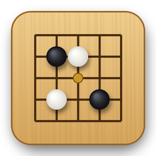
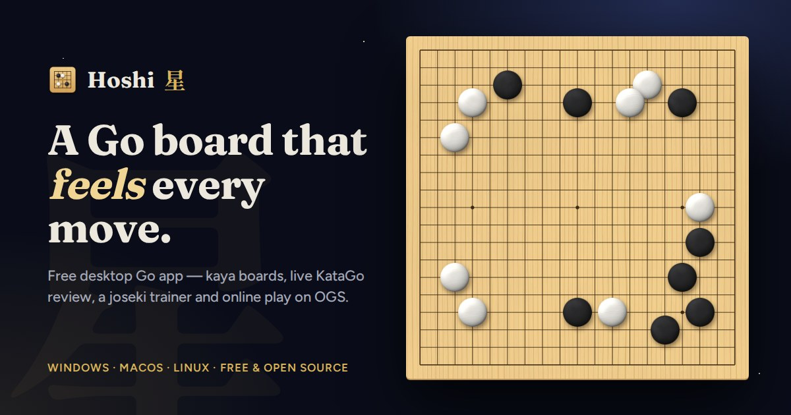
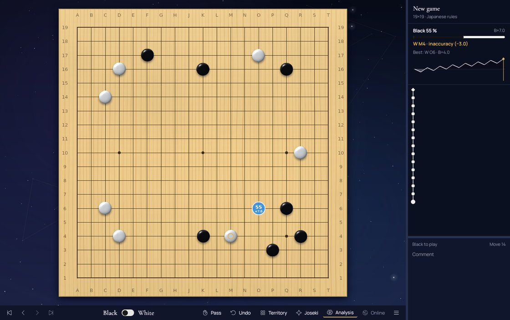
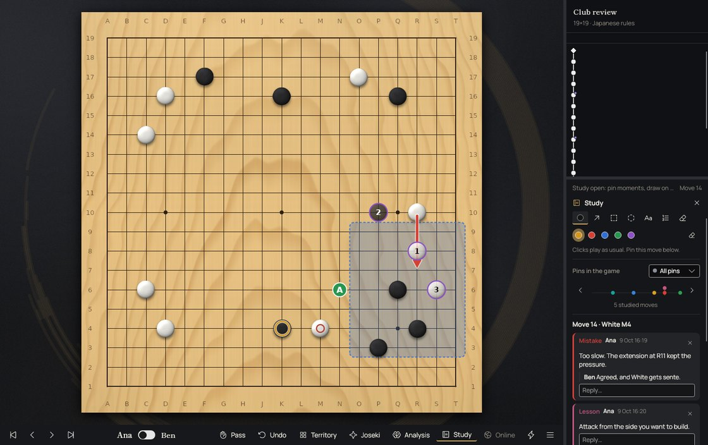
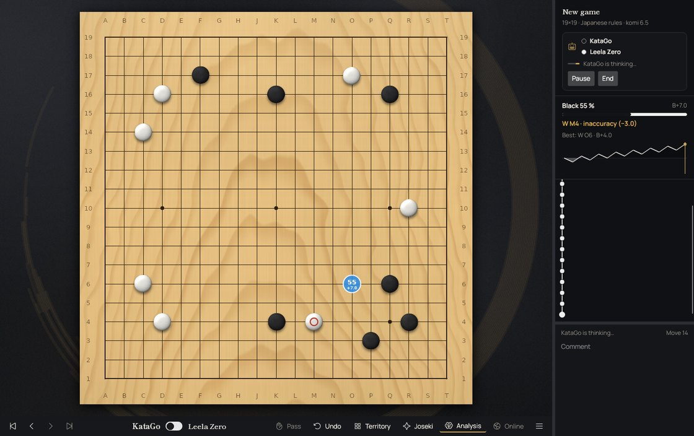
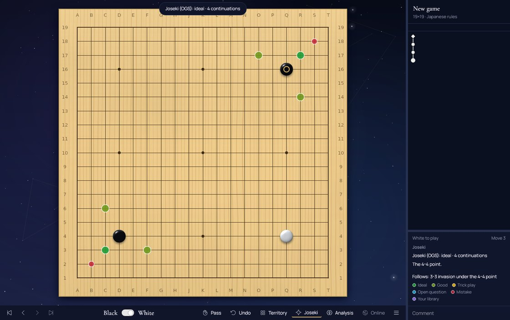
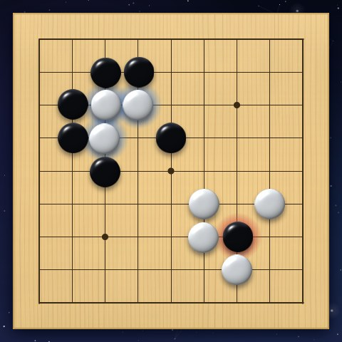
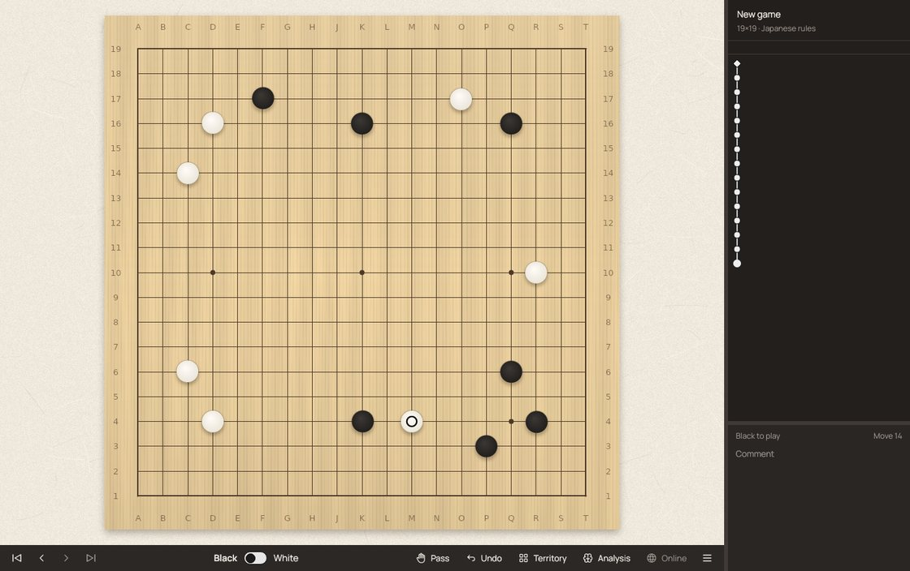
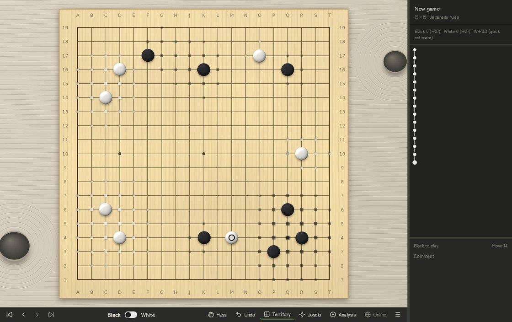

<div align="center">



# Hoshi 星

**A Go board that feels every move.**

A free desktop app to play and study Go (Baduk, Weiqi): a beautiful board, KataGo built in,
joseki guidance, engines, and online play on OGS.

[](https://github.com/BuddhaCodes/BadukDana/releases/latest)
[](https://github.com/BuddhaCodes/BadukDana/actions/workflows/ci.yml)


[**Website**](https://buddhacodes.github.io/BadukDana/) · [**Download**](#download) · [Features](#features) · [Support](#support-hoshi) · [Build it yourself](#for-developers)

<br>



</div>

## Download

Ready-to-run builds, no .NET needed. The installers keep Hoshi up to date by themselves (small delta updates).

| | Installer | Portable |
|---|---|---|
| **Windows** (x64) | [Setup.exe](https://github.com/BuddhaCodes/BadukDana/releases/latest/download/HoshiGo-win-x64-Setup.exe) | [.zip](https://github.com/BuddhaCodes/BadukDana/releases/latest/download/HoshiGo-win-x64-Portable.zip) |
| **Windows** (ARM64) | [Setup.exe](https://github.com/BuddhaCodes/BadukDana/releases/latest/download/HoshiGo-win-arm64-Setup.exe) | [.zip](https://github.com/BuddhaCodes/BadukDana/releases/latest/download/HoshiGo-win-arm64-Portable.zip) |
| **macOS** (Apple silicon) | [.pkg](https://github.com/BuddhaCodes/BadukDana/releases/latest/download/HoshiGo-osx-arm64-Setup.pkg) | [.zip](https://github.com/BuddhaCodes/BadukDana/releases/latest/download/HoshiGo-osx-arm64-Portable.zip) |
| **macOS** (Intel) | [.pkg](https://github.com/BuddhaCodes/BadukDana/releases/latest/download/HoshiGo-osx-x64-Setup.pkg) | [.zip](https://github.com/BuddhaCodes/BadukDana/releases/latest/download/HoshiGo-osx-x64-Portable.zip) |
| **Linux** (x64) | [.AppImage](https://github.com/BuddhaCodes/BadukDana/releases/latest/download/HoshiGo-linux-x64.AppImage) | [.tar.gz](https://github.com/BuddhaCodes/BadukDana/releases/latest/download/Hoshi-linux-x64.tar.gz) |
| **Linux** (ARM64) | [.AppImage](https://github.com/BuddhaCodes/BadukDana/releases/latest/download/HoshiGo-linux-arm64.AppImage) | [.tar.gz](https://github.com/BuddhaCodes/BadukDana/releases/latest/download/Hoshi-linux-arm64.tar.gz) |

> Windows may show a SmartScreen warning for new, unsigned apps: **More info → Run anyway**.
> KataGo comes with the Windows and Linux x64 downloads; elsewhere Hoshi installs it in one click.

## Features

<table>
<tr>
<td width="50%" valign="top">

### 🔍 Study with KataGo
KataGo runs in the background from the moment Hoshi opens and rates every move — best, excellent, good,
inaccuracy, mistake or blunder — with points lost, win rate, score graph and suggestions on the board.
A full SGF editor with variation tree, comments, marks and setup stones.

</td>
<td width="50%"></td>
</tr>
<tr>
<td width="50%"></td>
<td width="50%" valign="top">

### 📝 Review together
Press **S** in any game to pin the moments that mattered — mistake, good move, question, key moment,
joseki, life and death, lesson — and draw arrows, areas, letters and numbered "what if" lines without
touching the game. Save the study as an SGF and send it: your friend's notes and replies merge into yours.
Then test yourself with **What would you play?** or print a game report with KataGo's verdict on each moment.

</td>
</tr>
<tr>
<td width="50%" valign="top">

### ⚙️ Play any engine
Hoshi's own KataGo is ready out of the box; add Leela Zero, GNU Go, Pachi or any GTP engine.
Play against it (**Ctrl+G**) with any colour, handicap, komi and rules, let two engines play each other,
watch the traffic in the GTP console, or let your engine drive the analysis panel.

</td>
<td width="50%"></td>
</tr>
<tr>
<td width="50%"></td>
<td width="50%" valign="top">

### 📐 Never forget a joseki
Turn on **Joseki** and every corner shows the known continuations, coloured by how the OGS Joseki Explorer
rates them. The trainer (**Ctrl+J**) drills lines on the main board with spaced repetition.

</td>
</tr>
<tr>
<td width="50%" valign="top">

### ✦ A board that feels
The move that wins a fight shakes the board and cracks the wood; routine moves just click. Weak groups glow
faintly, captured stones shatter, and calm lo-fi music heats up at the key moments. Too much? Turn effects
down to subtle or off at any time with **F**.

</td>
<td width="50%"></td>
</tr>
<tr>
<td width="50%"></td>
<td width="50%" valign="top">

### 🌐 Play online
Sign in to [online-go.com](https://online-go.com), accept challenges and play in real time with clock and chat.
Fair play first: Hoshi only creates unranked games, and every engine, hint and analysis switches off during
your live OGS games.

</td>
</tr>
<tr>
<td width="50%" valign="top">

### 🎨 Make it yours
Five themes — Night sky, Ink and gold, Zen garden, Warm minimal and a Classic tribute — plus six gobans,
five stone sets and ten backgrounds to mix freely. Every board and stone is rendered by Hoshi itself.
English and Spanish.

</td>
<td width="50%"></td>
</tr>
</table>

**Also:** a library of every game you play (replay it and KataGo judges each move again), territory estimate,
face-to-face games on one screen, keyboard shortcuts, automatic updates. Free, open source, no account needed
to play locally, and your OGS password is never stored.

## Support Hoshi

Hoshi is free and open source, and will stay that way. If it brings you good games and you'd like to help it grow,
you can make a donation on [**PayPal ♥**](https://paypal.me/CarlosFernandez934). It is entirely optional — nothing
in Hoshi depends on it. Thank you either way.

> **A note on where donations go:** PayPal isn't available where I live, so donations are received on my behalf by
> a trusted collaborator, Carlos Fernandez — that's the name you'll see on the PayPal page.

Feedback is just as welcome: [open an issue](https://github.com/BuddhaCodes/BadukDana/issues) with a bug, an idea or
something that feels off. GTP engine support came from a player's comment.

---

## For developers

Built with **Avalonia 11** on **.NET 10** (C# 14), MVVM with CommunityToolkit.Mvvm. Status and plans:
[`docs/ROADMAP.md`](docs/ROADMAP.md) · architecture: [`docs/ARCHITECTURE.md`](docs/ARCHITECTURE.md) ·
visual design: [`docs/DESIGN.md`](docs/DESIGN.md) · OGS notes: [`docs/OGS_API.md`](docs/OGS_API.md).

### Build, test, run

Requires the .NET SDK 10.0 (`global.json` pins the minimum feature band 10.0.100).

```bash
dotnet build
dotnet test
dotnet run --project src/Hoshi.App
```

Logs are written to the per-user data folder (`%LOCALAPPDATA%\Hoshi\logs` on Windows,
`~/Library/Application Support/Hoshi/logs` on macOS, `~/.local/share/Hoshi/logs` on Linux).

### Layout

```
src/
  Hoshi.Core/     Pure Go rules: captures, ko, scoring, fights, group strength (no UI, no I/O)
  Hoshi.Sgf/      SGF parser/serializer and game tree
  Hoshi.Ogs/      online-go.com client (OAuth + PKCE, REST, WebSocket)
  Hoshi.Engines/  KataGo analysis engine (JSON) and a GTP client for any engine
  Hoshi.App/      Avalonia application
tests/            xUnit + FluentAssertions, Avalonia.Headless for UI
docs/             Architecture, design, OGS API notes, roadmap; docs/site is the website
```

Dependency rule: `App → Ogs, Sgf, Engines, Core` · `Ogs → Core` · `Sgf → Core` · `Engines → Core` · `Core → nothing`
(enforced by `tests/Hoshi.App.Tests/ArchitectureTests.cs`).

### Releases and website

`.github/workflows/release.yml` builds and publishes the installers (Velopack) once CI has passed on `main`
(version `0.1.<run number>`; nothing is published when only `docs/`, `.github/` or Markdown files changed).
The website in `docs/site` is published by `.github/workflows/pages.yml`.

### Development against OGS

Pick the server in the lobby (**Ctrl+L** or "Online"); it does not depend on the .NET environment.

| Server | Sign-in |
|---|---|
| `https://online-go.com` (default) | "Continue with Google" or "Sign in with OGS": browser OAuth (authorization code + PKCE, public client, redirect `http://127.0.0.1:8734/callback`). |
| `https://beta.online-go.com` (testing) | Username + password (beta cannot register OAuth apps). The password is never stored. |

"Continue with Google" always uses online-go.com. There: unranked, private games against your own second
account only. Hoshi never creates or accepts ranked games. Set `Ogs:DefaultServer` to `beta` in `appsettings.json`
to start on beta. No secrets live in the repository: the OAuth client id is public.

### Credits

Inspired by [Sabaki](https://github.com/SabakiHQ/Sabaki), whose look and feel we love — no Sabaki code is used.
Third-party assets and their licenses are listed in [`THIRD_PARTY_NOTICES.md`](THIRD_PARTY_NOTICES.md).
